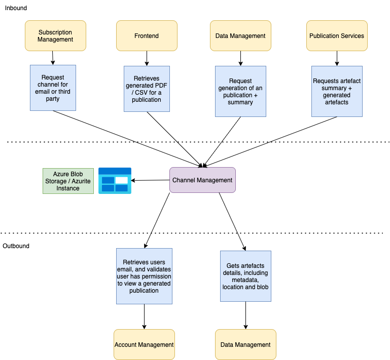

# pip-channel-management

## Table of Contents

- [Overview](#overview)
  - [Subscription Channels](#subscription-channels)
  - [Alternative publishing formats](#alternative-publishing-formats)
- [Features and Functionality](#features-and-functionality)
- [JSON to PDF + Summary Conversion](#json-to-pdf--summary-conversion)
- [Roles](#roles)
- [Architecture Diagram](#architecture-diagram)
- [Getting Started](#getting-started)
  - [Prerequisites](#prerequisites)
    - [General](#general)
    - [Local development](#local-development)
    - [Nice-to-haves](#nice-to-haves)
  - [Installation](#installation)
  - [Configuration](#configuration)
    - [Environment variables](#environment-variables)
      - [Getting all environment variables with python](#get-environment-variables-with-python-scripts)
      - [Additional Test secrets](#additional-test-secrets)
      - [Application.yaml files](#applicationyaml-files)
- [API Documentation](#api-documentation)
- [Examples](#examples)
  - [Requesting a bearer token](#requesting-a-bearer-token)
  - [Using the bearer token](#using-the-bearer-token)
- [Deployment](#deployment)
- [Monitoring and Logging](#monitoring-and-logging)
  - [Application Insights](#application-insights)
- [Security & Quality Considerations](#security--quality-considerations)
- [Test Suite](#test-suite)
  - [Unit tests](#unit-tests)
  - [Functional tests](#functional-tests)
- [Contributing](#contributing)
- [License](#license)

## Overview
`pip-channel-management` is a microservice that deals with operations related to retrieving subscription channels, and the generation of alternative publishing formats used throughout the subscription process (such as PDFs).

It sits within the Court and Tribunal Hearings Service (CaTH hereafter), written with Spring Boot/Java.

In practice, the service is usually containerized within a hosted kubernetes environment within Azure.

Broadly speaking, this service has two main components detailed below:

##### Subscription Channels
- For email subscriptions, it maps the subscriptions to their related email address.
- For third party subscription, it retrieves the API address to send the subscription to.

##### Alternative publishing formats
- The generation (and associated CRUD operations) of PDFs and Excel spreadsheets for JSON publications.
- The generation of a publication summary for JSON publications, which is used in the subscription process.

All interactions with `pip-channel-management` are performed through the API (specified in [API Documentation](#api-documentation)) either as a standalone service or via connections to other microservices.

## Features and Functionality

- Generation of PDFs from JSON for each list type. These are used in the subscriptions process and also via the Frontend
- Generation of publication summary, which contains details about a JSON publication. This is used in the subscription email.
- Mapping of a list of subscriptions to their appropriate email. It also de-duplicates the list, which in turn means only one email is sent per user.
- Mapping a third party subscription to its appropriate API endpoint.
- Azure Blob Storage: Handles interactions with the CaTH Azure Blob Storage instance (or local Azurite emulator/Azure Storage Explorer instances)
- Secure/Insecure Mode: Use of bearer tokens for authentication with the secure instance (if desired)
- OpenAPI Spec/Swagger-UI: Documents and allows users or developers to access API resources within the browser.
- Integration tests, which talk to Data Management in staging to retrieve publications.

## JSON to PDF + Summary Conversion

Each List Type has a related converter and summary generated. This is stored in the List Type enum [here](./src/main/java/uk/gov/hmcts/reform/pip/channel/management/models/external/datamanagement/ListType.java)

The converter does a very similar job to the frontend style guides. It maps the JSON data to an associated accessible PDF, and also Excel spreadsheets for certain list types.

The summary generator produces a string that is used in the subscription email that contains key fields extracted from the blob. These fields vary depending on the list type.

## Roles

Any endpoint that should require authentication, needs to be annotated either at controller or endpoint level with @IsAdmin.

## Architecture Diagram



The above diagram is somewhat simplified for readability (e.g. it does not include secure/insecure communications, but those are covered elsewhere).

## Getting Started

### Prerequisites

##### General

- [Java JDK 17](https://openjdk.org/projects/jdk/17/) - this is used throughout all of our services.
- REST client of some description (e.g. [Curl](https://github.com/curl/curl), [Insomnia](https://insomnia.rest/), [Postman](https://www.postman.com/)). Swagger-UI can also be used to send requests.

##### Local development

- [Azurite](https://learn.microsoft.com/en-us/azure/storage/common/storage-use-azurite) - Local Azure emulator used along with Azure Storage explorer for local storage.
- [Azure Storage Explorer](https://azure.microsoft.com/en-us/products/storage/storage-explorer) - Used for viewing and storing blobs within an Azurite instance locally.

##### Nice-to-haves

- [pip-dev-env](https://github.com/hmcts/pip-dev-env) - This repo provides a development environment wherein ensure all microservices, as well as external services (e.g. postgres & redis) are all running in tandem within the service. It eases the development process and is particularly helpful when working with cross-service communication, as it also reduces strain on local performance from having many separate IDE windows open.

### Installation

- Clone the repository
- Ensure all required [environment variables](#environment-variables) have been set.
- Build using the command `./gradlew clean build`
- Start the service using the command `./gradlew bootrun` in the newly created directory.

### Configuration

#### Environment Variables

Environment variables are used by the service to control its behaviour in various ways.

These variables can be found within various separate CaTH Azure keyvaults. You may need to obtain access to this via a support ticket.
- Runtime secrets are stored in `pip-ss-{env}-kv` (where {env} is the environment where the given instance is running (e.g. production, staging, test, sandbox)).
- Test secrets are stored in `pip-bootstrap-{env}-kv` with the same convention.

##### Get environment variables with python scripts
Python scripts to quickly grab all environment variables (subject to Azure permissions) are available for both [runtime](https://github.com/hmcts/pip-dev-env/blob/master/get_envs.py) and [test](https://github.com/hmcts/pip-secret-grabber/blob/master/main.py) secrets.

##### Runtime secrets

Below is a table of currently used environment variables for starting the service, along with a descriptor of their purpose and whether they are optional or required.

| Variable                  | Description                                                                                                                                                                                                                                                            |Required?|
|:--------------------------|:-----------------------------------------------------------------------------------------------------------------------------------------------------------------------------------------------------------------------------------------------------------------------|--|
| SPRING_PROFILES_ACTIVE    | If set equal to `dev`, the application will run in insecure mode (i.e. no bearer token authentication required for incoming requests.) *Note - if you wish to communicate with other services, you will need to set them all to run in insecure mode in the same way.* |No|
| APP_URI                   | Uniform Resource Identifier - the location where the application expects to receive bearer tokens after a successful authentication process. The application then validates received bearer tokens using the AUD parameter in the token                                |No|
| CLIENT_ID                 | Unique ID for the application within Azure AD. Used to identify the application during authentication.                                                                                                                                                                 |No|
| TENANT_ID                 | Directory unique ID assigned to our Azure AD tenant. Represents the organisation that owns and manages the Azure AD instance.                                                                                                                                          |No|
| CLIENT_SECRET             | Secret key for authentication requests to the service.                                                                                                                                                                                                                 |No|
| CONNECTION_STRING         | Connection string for connecting to the Azure Blob Storage service. Only required when running the application locally via Azurite.                                                                                                                                    |Yes|
| STORAGE_ACCOUNT_NAME      | Azure storage account name used to construct the storage account endpoint. Not required when running the application locally.                                                                                                                                          |No|
| ACCOUNT_MANAGEMENT_URL    | URL used for connecting to the pip-account-management service. Defaults to staging if not provided.                                                                                                                                                                    |No|
| DATA_MANAGEMENT_URL       | URL used for connecting to the pip-data-management service. Defaults to staging if not provided.                                                                                                                                                                       |No|
| ACCOUNT_MANAGEMENT_AZ_API | Used as part of the `scope` parameter when requesting a token from Azure. Used for service-to-service communication with the pip-account management service                                                                                                            |No|
| DATA_MANAGEMENT_AZ_API    | Used as part of the `scope` parameter when requesting a token from Azure. Used for service-to-service communication with the pip-data-management service                                                                                                               |No|
| COURTEL_API               | API value for third party                                                                                                                                                                                                                                              |No|

##### Additional Test secrets

Secrets required for getting tests to run correctly can be found in the below table:

| Variable                  | Description                                                                            |
|:--------------------------|:---------------------------------------------------------------------------------------|
| CLIENT_ID                 | As above                                                                               |
| CLIENT_SECRET             | As above                                                                               |
| APP_URI                   | As above                                                                               |
| TENANT_ID                 | As above                                                                               |
| ACCOUNT_MANAGEMENT_AZ_API | As above                                                                               |
| DATA_MANAGEMENT_AZ_API    | As above                                                                               |
| VERIFIED_USER_ID          | Value for the provenance of a verified used as a header on authentication-bound tests. |

#### Application.yaml files
The service can also be adapted using the yaml files found in the following locations:
- [src/main/resources/application.yaml](./src/main/resources/application.yaml) for changes to the behaviour of the service itself.
- [src/main/resources/application-dev.yaml](./src/main/resources/application-dev.yaml) for changes to the behaviour of the service when running locally.
- [src/test/resources/application-test.yaml](./src/test/resources/application-test.yaml) for changes to other test types (e.g. unit tests).

## API Documentation
Our full API specification can be found within our Swagger-UI page.
It can be accessed locally by starting the service and going to [http://localhost:8181/swagger-ui/swagger-ui/index.html](http://localhost:8181/swagger-ui/swagger-ui/index.html)
Alternatively, if you're on our VPN, you can access the swagger endpoint at our staging URL (ask a teammate to give you this).

## Examples
As mentioned, the full api documentation can be found within swagger-ui, but some of the most common operations are highlighted below.

Most of the communication with this service benefits from using secure authentication. While possible to stand up locally in insecure mode, to simulate a production environment it is better to use secure mode.
Before sending in any requests to the service, you'll need to obtain a bearer token using the following approach:

### Requesting a bearer token
To request a bearer token, sending a post request following this template:
```
curl --request POST \
  --url https://login.microsoftonline.com/{TENANT_ID}/oauth2/v2.0/token \
  --header 'Content-Type: multipart/form-data' \
  --form client_id={CLIENT_ID_FOR_ANOTHER_SERVICE} \
  --form scope={APP_URI}/.default \
  --form client_secret={CLIENT_SECRET_FOR_ANOTHER_SERVICE}\
  --form grant_type=client_credentials
```
You can copy the above curl command into either Postman or Insomnia and they will automatically be converted to the relevant formats for those programs.

*Note - the `_FOR_ANOTHER_SERVICE` variables need to be extracted from another registered microservice within the broader CaTH umbrella (e.g. [pip-subscription-management](https://github.com/hmcts/pip-subscription-management))*

### Using the bearer token
You can use the bearer token in the Authorization header when making requests. Here is an example using the generate files endpoint.
```
curl --request POST \
  --url http://localhost:8181/publication/{artefactId} \
  --header 'Authorization: Bearer {BEARER_TOKEN_HERE}' \
```

## Deployment
We use [Jenkins](https://www.jenkins.io/) as our CI/CD system. The deployment of this can be controlled within our application logic using the various `Jenkinsfile`-prepended files within the root directory of the repository.

Our builds run against our `dev` environment during the Jenkins build process. As this is a microservice, the build process involves standing up the service in a docker container in a Kubernetes cluster with the current staging master copies of the other interconnected microservices.

If your debugging leads you to conclude that you need to implement a pipeline fix, this can be done in the [CNP Jenkins repo](https://github.com/hmcts/cnp-jenkins-library)

## Monitoring and Logging
We utilise [Azure Application Insights](https://learn.microsoft.com/en-us/azure/azure-monitor/app/app-insights-overview) to store our logs. Ask a teammate for the specific resource in Azure to access these.
Locally, we use [Log4j](https://logging.apache.org/log4j/2.x/).

In addition, this service is also monitored in production and staging environments by [Dynatrace](https://www.dynatrace.com/). The URL for viewing our specific Dynatrace instance can be had by asking a team member.

### Application Insights

Application insights is configured via the lib/applicationinsights.json file. Alongside this, the Dockerfile is configured to copy in this file and also download the app insights client.

The client at runtime is attached as a javaagent, which allows it to send the logging to app insights.

To connect to app insights a connection string is used. This is configured to read from the KV Secret mounted inside the pod.

It is possible to connect to app insights locally, although somewhat tricky. The easiest way is to get the connection string from azure, set it as an environment variable (APPLICATIONINSIGHTS_CONNECTION_STRING), and add in the javaagent as VM argument. You will also need to remove / comment out the connection string line the config.
## Security & Quality Considerations
We use a few automated tools to ensure quality and security within the service. A few examples can be found below:

- SonarCloud - provides automated code analysis, finding vulnerabilities, bugs and code smells. Quality gates ensure that test coverage, code style and security are maintained where possible.
- DependencyCheckAggregate - Ensures that dependencies are kept up to date and that those with known security vulnerabilities (based on the [National Vulnerability Database(NVD)](https://nvd.nist.gov/)) are flagged to developers for mitigation or suppression.
- JaCoCo Test Coverage - Produces code coverage metrics which allows developers to determine which lines of code are covered (or not) by unit testing. This also makes up one of SonarCloud's quality gates.
- PMD - Static code analysis tool providing code quality guidance and identifying potential issues relating to coding standards, performance or security.
- CheckStyle - Enforces coding standards and conventions such as formatting, naming conventions and structure.

## Test Suite

This microservice is comprehensively tested using both unit and functional tests.

### Unit tests

Unit tests can be run on demand using `./gradlew test`.

### Functional tests

Functional tests can be run using `./gradlew functional`

For our functional tests, we are using Square's [MockWebServer](https://github.com/square/okhttp/tree/master/mockwebserver) library. This allows us to test the full HTTP stack for our service-to-service interactions.

The functional tests also call out to Data Management in staging to retrieve publications.

## Contributing
We are happy to accept third-party contributions. See [.github/CONTRIBUTING.md](./.github/CONTRIBUTING.md) for more details.

## License
This project is licensed under the MIT License - see the [LICENSE](./LICENSE) file for details.
